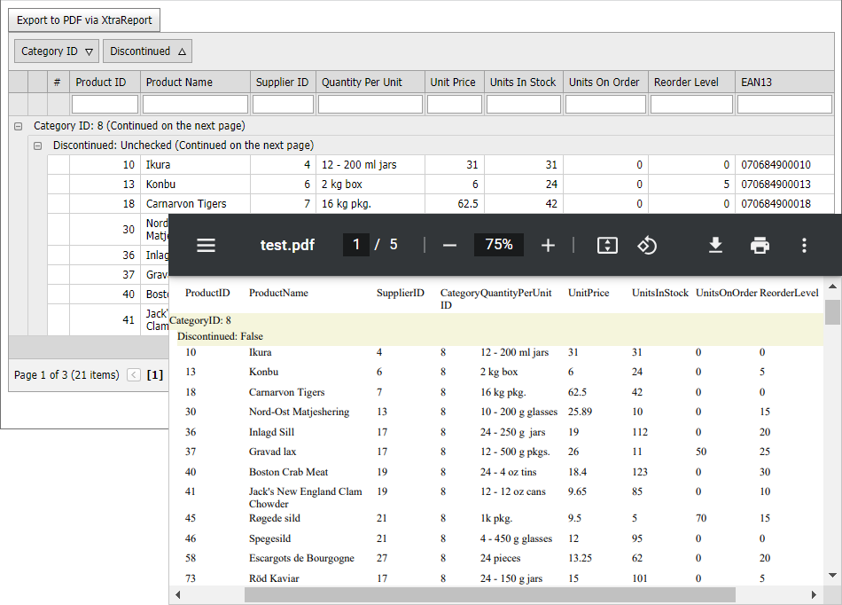

<!-- default badges list -->

<!-- default badges end -->
# Grid View for ASP.NET Web Forms - How to create a report based on grid data
This example demonstrates how to dynamically create a [DevExpress report](https://docs.devexpress.com/XtraReports/DevExpress.XtraReports.UI.XtraReport) based on the [ASPxGridView](https://docs.devexpress.com/AspNet/5823/components/grid-view) control's data and layout. The resulting report maintains all sorting, grouping, and filtering settings applied to the grid. The example code exports this report to a PDF file, but you can also insert the resulting report into another report.

Follow the steps below to create a report based on the Grid View control's data:

1. Create an instance of the [XtraReport](https://docs.devexpress.com/XtraReports/DevExpress.XtraReports.UI.XtraReport) class.
2. Bind the instance to the Grid View's data source.
3. Based on the Grid layout, create [bands](https://docs.devexpress.com/XtraReports/2587/detailed-guide-to-devexpress-reporting/introduction-to-banded-reports) and add them to the report.
4. Create [report controls](https://docs.devexpress.com/XtraReports/2605/detailed-guide-to-devexpress-reporting/use-report-controls) and add them to the bands.

## Files to Review

* [Default.aspx](./CS/WebApplication1/Default.aspx) (VB: [Default.aspx](./VB/WebApplication1/Default.aspx))
* [Default.aspx.cs](./CS/WebApplication1/Default.aspx.cs) (VB: [Default.aspx.vb](./VB/WebApplication1/Default.aspx.vb))
* [ReportHelper.cs](./CS/WebApplication1/ReportHelper.cs) (VB: [ReportHelper.vb](./VB/WebApplication1/ReportHelper.vb))

## Documentation

* [Create a Report in Code](https://docs.devexpress.com/XtraReports/115726/detailed-guide-to-devexpress-reporting/reporting-api/create-reports-in-code)

## More examples

* [Grid View for ASP.NET MVC - How to create a report based on grid data](https://github.com/DevExpress-Examples/how-to-convert-and-then-print-an-gridview-extension-by-using-the-xtrareport-e4755)
<!-- feedback -->
## Does this example address your development requirements/objectives?

 

(you will be redirected to DevExpress.com to submit your response)
<!-- feedback end -->
